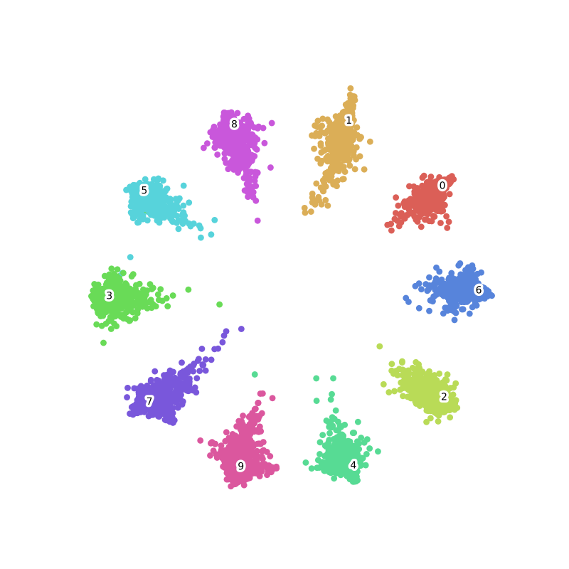
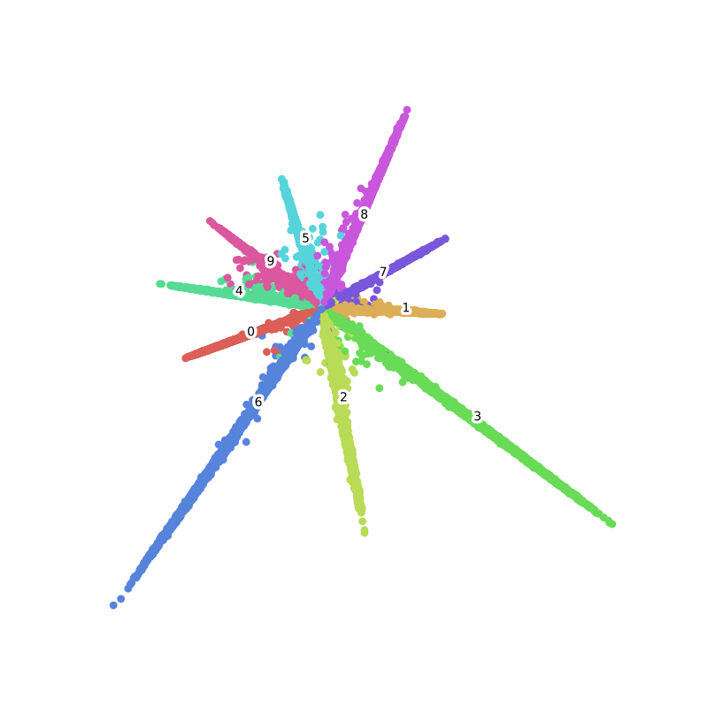
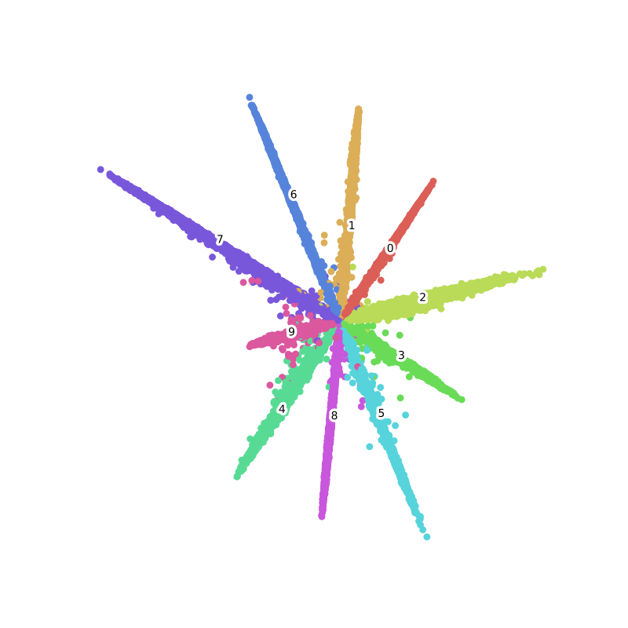
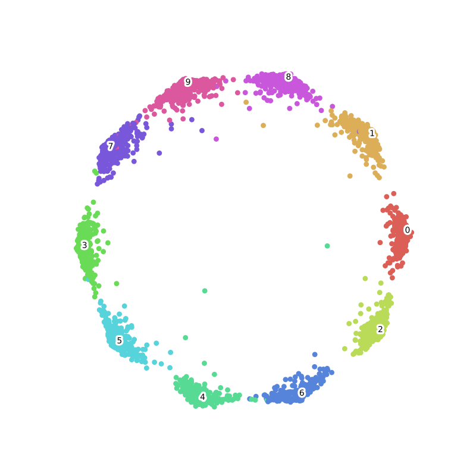
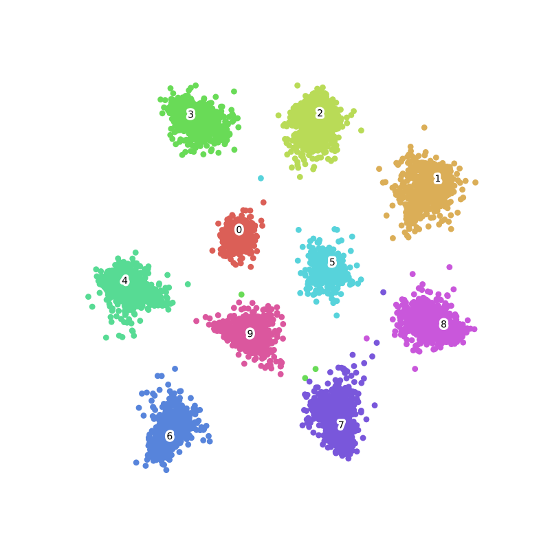

Gluon Face Toolkit
==================

GluonFR是一个基于MXNet Gluon API实现的人脸识别工具箱.
此项目灵感来自GluonCV, 并按照其结构组织. 除了帮助研究者和开发者们迅速上手目前最前沿的人脸识别算法,
也希望能够让更多的人了解Gluon这一好用的工具, 使用MXNet-Gluon进行深度学习算法的研究.

.. hint::
    如果你不了解MXNet和Gluon, 请参考\ `《动手学深度学习》 <http://zh.d2l.ai/>`__.

Gluon Face提供目前人脸识别中主流的损失函数, 包括ArcLoss, TripletLoss,
RingLoss, CosLoss, L2Softmax, ASoftmax, CenterLoss, ContrastiveLoss等, 在此基础上我们会继续更新.
如果有希望我们实现的损失函数, 欢迎提交 `issue <https://github.com/THUFutureLab/gluon-face/issues>`__.

Gluon Face中的损失函数
-----------------------

下表中最后一列是论文中在LFW上的最优结果, 训练数据/网络结构可能不同, 仅供参考.

+---------------------+-------------------------------------------------------------------------------------------------------+--------------------------+--------------+
| Method              | Paper                                                                                                 | Visualization of MNIST   | LFW          |
+=====================+=======================================================================================================+==========================+==============+
| Contrastive Loss    | `ContrastiveLoss <http://yann.lecun.com/exdb/publis/pdf/hadsell-chopra-lecun-06.pdf>`__               |    -                     | -            |
+---------------------+-------------------------------------------------------------------------------------------------------+--------------------------+--------------+
| Triplet             | `1503.03832 <https://arxiv.org/abs/1503.03832>`__                                                     |    -                     | 99.63±0.09   |
+---------------------+-------------------------------------------------------------------------------------------------------+--------------------------+--------------+
| Center Loss         | `CenterLoss <https://ydwen.github.io/papers/WenECCV16.pdf>`__                                         |    |img2|                | 99.28        |
+---------------------+-------------------------------------------------------------------------------------------------------+--------------------------+--------------+
| L2-Softmax          | `1703.09507 <https://arxiv.org/abs/1703.09507>`__                                                     |    -                     | 99.33        |
+---------------------+-------------------------------------------------------------------------------------------------------+--------------------------+--------------+
| A-Softmax           | `1704.08063 <https://arxiv.org/abs/1704.08063>`__                                                     |    -                     | 99.42        |
+---------------------+-------------------------------------------------------------------------------------------------------+--------------------------+--------------+
| CosLoss/AMSoftmax   | `1801.05599 <https://arxiv.org/abs/1801.05599>`__/`1801.05599 <https://arxiv.org/abs/1801.05599>`__   |    |img3|                | 99.17        |
+---------------------+-------------------------------------------------------------------------------------------------------+--------------------------+--------------+
| Arcloss             | `1801.07698 <https://arxiv.org/abs/1801.07698>`__                                                     |    |img4|                | 99.82        |
+---------------------+-------------------------------------------------------------------------------------------------------+--------------------------+--------------+
| Ring loss           | `1803.00130 <https://arxiv.org/abs/1803.00130>`__                                                     |    |img5|                | 99.52        |
+---------------------+-------------------------------------------------------------------------------------------------------+--------------------------+--------------+
| LGM Loss            | `1803.02988 <https://arxiv.org/abs/1803.02988>`__                                                     |    |img6|                | 99.20±0.03   |
+---------------------+-------------------------------------------------------------------------------------------------------+--------------------------+--------------+

作者
----

{ `haoxintong <https://github.com/haoxintong>`__
`Yangxv <https://github.com/PistonY>`__
}

讨论区
------

我们的讨论区在 `Gluon中文论坛 <https://discuss.gluon.ai/t/topic/9959>`__

参考文献
--------

1. MXNet 文档和教程
   http://zh.d2l.ai/

2. NVIDIA DALI 文档\ `NVIDIA DALI
   documentation <https://docs.nvidia.com/deeplearning/sdk/dali-developer-guide/docs/index.html>`__

3. Deepinsight
   `insightface <https://github.com/deepinsight/insightface>`__

.. toctree::
    :hidden:

    主页 <self>
    安装 <install>
    数据 <datasets>
    模型 <model_zoo>
    API参考 <api/index>
